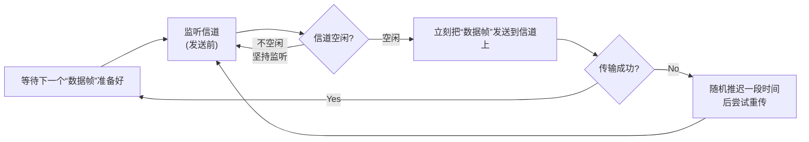

# 1-persistent CSMA

> 坚持监听，积极发送

- Pros
  - 信道一旦空闲就允许发送，信道利用率高
- Cons
  - 一旦信道空闲，就会有多个节点同时发送数据，冲突概率大

```mermaid
flowchart LR
    Wait["等待下一个“数据帧”准备好"]
    Listen["监听信道<br>(发送前)"]
    CheckIdle{"信道空闲?"}
    Send["立刻把“数据帧”发送到信道上"]
    CheckSuccess{"传输成功?"}
    Delay["随机推迟一段时间<br>后尝试重传"]

    Wait --> Listen
    Listen --> CheckIdle
    CheckIdle -->|不空闲<br>坚持监听| Listen

    CheckIdle -->|空闲| Send
    Send --> CheckSuccess

    CheckSuccess -->|Yes| Wait
    CheckSuccess -->|No| Delay
    Delay --> Listen
```
