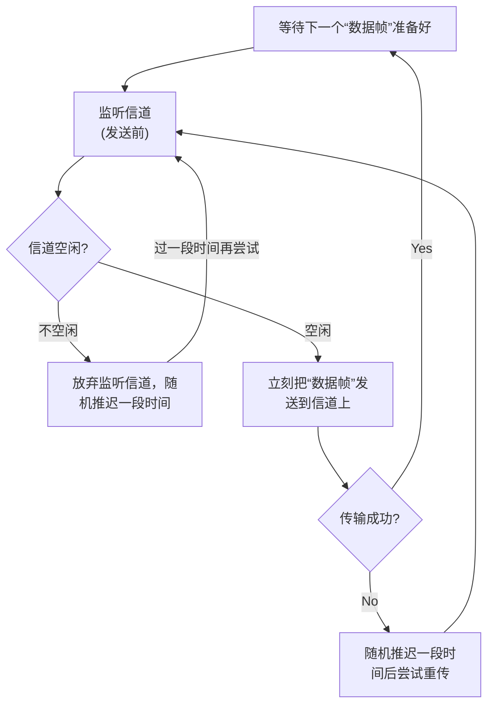

# Non-persistent CSMA

- 不坚持监听，积极发送
- 解决了 1-坚持 CSMA 的缺点
- Pros
  - 降低了冲突概率
- Cons
  - 降低了信道利用率

```mermaid
flowchart TD
    Wait["等待下一个“数据帧”准备好"]
    Listen["监听信道<br/>(发送前)"]
    IsIdle{"信道空闲?"}
    Defer["放弃监听信道，随<br/>机推迟一段时间"]
    Send["立刻把“数据帧”发<br/>送到信道上"]
    IsSuccess{"传输成功?"}
    Retry["随机推迟一段时<br/>间后尝试重传"]

    Wait --> Listen
    Listen --> IsIdle
    
    IsIdle -- "空闲" --> Send
    Send --> IsSuccess
    
    IsIdle -- "不空闲" --> Defer
    Defer -- "过一段时间再尝试" --> Listen
    
    IsSuccess -- "No" --> Retry
    Retry --> Listen
    
    IsSuccess -- "Yes" --> Wait
```
