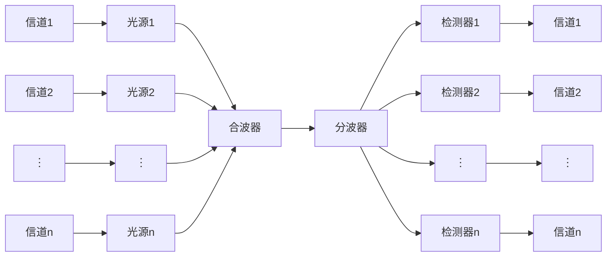

# Channel Multiplexing

Table of Contents:

- [Channel Multiplexing](#channel-multiplexing)
  - [时分多路复用 TDM](#时分多路复用-tdm)
  - [统计时分多路复用 STDM](#统计时分多路复用-stdm)
  - [频分多路复用 FDM](#频分多路复用-fdm)
  - [波分多路复用 WDM](#波分多路复用-wdm)
  - [码分多路复用 CDM](#码分多路复用-cdm)

## 时分多路复用 TDM

> 将时间划分为一段段等长的 TDM 帧，每个用户在每一个 TDM 帧中占用固定序号的时隙。

缺點：

- 每个节点最多分配到 1/n 的带宽
- 节点闲置会导致信道利用率低

```mermaid
gantt
    title TDM: 假設一個 TDM 幀為 30 分鐘
    dateFormat  HH:mm
    axisFormat %H:%M

    section TDM 帧
        第 1 帧 (A1+B1+C1) :crit, frame1, 00:00, 30m
        第 2 帧 (A2+B2+C2) :crit, frame2, 00:30, 30m
        第 3 帧 (A3+B3+C3) :crit, frame3, 01:00, 30m

    section 用戶 A
        A 占用: a1, 00:00, 10m
        A 占用: a2, 00:30, 10m
        A 占用: a3, 01:00, 10m

    section 用戶 B
        B 占用: b1, 00:10, 10m
        B 占用: b2, 00:40, 10m
        B 占用: b3, 01:10, 10m

    section 用戶 C
        C 占用: c1, 00:20, 10m
        C 占用: c2, 00:50, 10m
        C 占用: c3, 01:20, 10m
```

## 统计时分多路复用 STDM

> 节点同样在时间上互斥访问信道，但是会统计节点的通信需求，需求大的节点分配更多时隙。

## 频分多路复用 FDM

> 所有用户在同样的时间占用不同的频段资源。

## 波分多路复用 WDM

> 与 FDM 本质上是一样的，但是更关注波长而非频率，常用于光纤信道。

## 码分多路复用 CDM

给各个节点分配**唯一的** m 维码片序列 $\overrightarrow{c_i}$，**各节点的码片序列向量必须正交，滿足 $\overrightarrow{c_1} \times \overrightarrow{c_2} = 0$**。

範例：A 站向 B 站發送數據的流程

- A 站發送信號
  - 若要發送 1: 發送碼片序列 $\overrightarrow{c_a}$
  - 若要發送 0: 發送碼片序列 $-\overrightarrow{c_a}$
- B 站解析数据
  - B 收到叠加信號 $\overrightarrow{m}$（可能很多站會給 B 發送信號）
  - 計算 $a = \overrightarrow{m} \cdot \overrightarrow{c_a}$，實際上會計算規格化内積
  - a 為 0  → A 站未發送信號
  - a 為 1  → A 站發送了 1
  - a 為 -1 → A 站發送了 0
