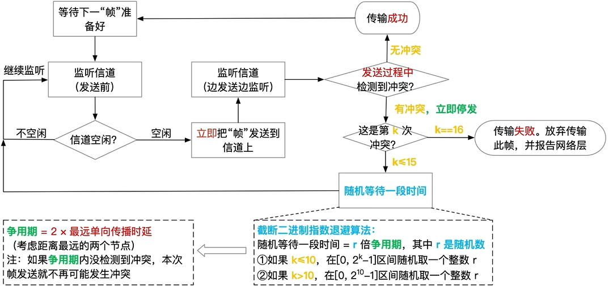

# Carrier Sense Multiple Access/Collision Detection

> [!note]
> CSMA/CD 主要用于交换机普及前的早期以太网。

CSMA/CD 通常采用 [[1-persistent_csma|1-p CSMA]]

流程圖：

## 爭用期

爭用期為：
$$2 \times 最大单向传播时延$$
从发送数据开始，經過争用期内若未发生冲突，就認爲不再可能发生冲突。  
经过 1 个最大单向传播时延可以占领信道，经过 2 个最大单向传播时延可以确信无冲突。

## 衝突處理策略

發送數據過程中，檢測到衝突立即停止發送。采用截断二进制指数退避算法來確定等待時間。第 16 次衝突發生則認爲信道繁忙或不可用，放棄嘗試。

## 最短帧长

> 为了让节点在发送完一个帧前就能够检测到冲突，CSMA/CD 需要规定最短帧长。收到不满足最短帧长的帧可以直接丢弃。以太网規定最小帧长為 64 Byte。  

公式：
$$争用期 \times 信道带宽$$

## 最大帧长

> 为了公平的介质访问、减少出错重传的概率、简化硬件缓冲区的设计等，CSMA/CD 需要规定最大帧长。以太网規定最大帧长為 1518 Byte。
