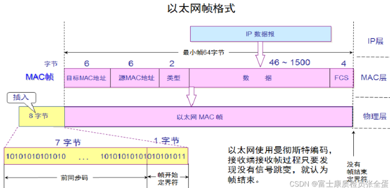

# IEEE 802.11 Ethernet

> [!note]
> 關於以太網幀格式：現在絕大多數網路流量都使用 Ethernet II（也叫 v2）格式。和標準以太網相比，他們分別將第 13-14 位解釋爲 `Length`（標準以太網） 與 `Type`（Ethernet II）。  
> 802.3 後來也把 Ethernet II 納入相容，所以現在兩種格式可以同時存在同一條線路上。

在數據鏈路層提供无连接、不可靠的服务。

## 802.11 Frame Format

