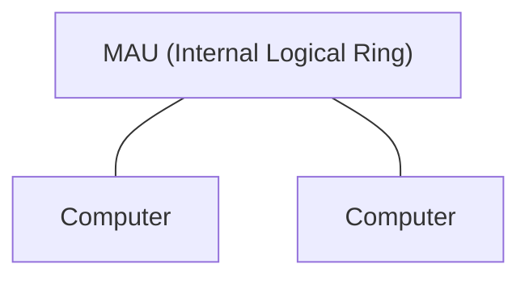
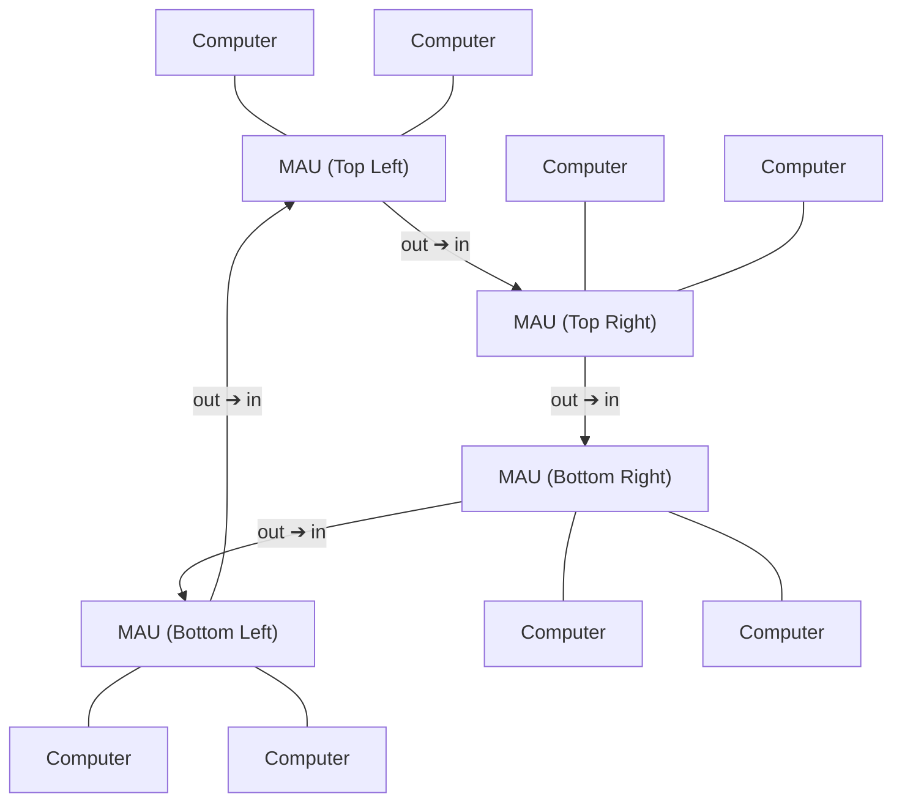

# Token Passing

两种帧

  令牌帧

    在环上流动

    只有持有这个帧的站才能发送数据

    持有令牌的节点没有数据要发送，则直接传递令牌

  数据/控制帧

    持有令牌的站需要发送数据，会将令牌帧转化为数据帧，将已接收字段设为 false

    其他节点接收了数据并校验成功，会将已接收设为 true

    发送站发现发出的帧没有被接收，可以认为发生了异常状况

多站接入单元，MAU

  令牌环网在逻辑上是一个环，在物理上是以 MAU 为中心的星型拓扑

  MAU 是令牌环网的关键设备

  它将所有站的端口物理上连接到一个中心点，但逻辑上通过内部继电器或电子开关将这些站点组成一个闭合的环
  
  MAU 还有两个端口，用于构造更大的令牌环网

令牌环网没有冲突问题，比 CSMA/CD 以太网更适合负载高的网络

