# Mermaid

- [Mermaid](#mermaid)
  - [What is Mermaid](#what-is-mermaid)
    - [Why Mermaid](#why-mermaid)
    - [核心理念](#核心理念)
    - [支援的圖表類型](#支援的圖表類型)
  - [通用語法規則與配置](#通用語法規則與配置)
    - [基本結構](#基本結構)
    - [Frontmatter 配置](#frontmatter-配置)
    - [指令](#指令)
    - [註釋與特殊處理](#註釋與特殊處理)
    - [文字格式](#文字格式)
  - [流程圖（Flowchart）](#流程圖flowchart)
    - [節點形狀](#節點形狀)
    - [連接綫](#連接綫)
    - [子圖](#子圖)
  - [序列圖（Sequence Diagram）](#序列圖sequence-diagram)
    - [訊息類型](#訊息類型)
    - [進階功能](#進階功能)
    - [範例（API 呼叫流程）](#範例api-呼叫流程)
  - [類別圖（Class Diagram）](#類別圖class-diagram)
    - [關係符號](#關係符號)
    - [完整範例（OOP 設計）](#完整範例oop-設計)
  - [狀態圖（State Diagram）](#狀態圖state-diagram)
    - [基本語法](#基本語法)
    - [複合狀態](#複合狀態)
  - [實體關係圖（ER Diagram）](#實體關係圖er-diagram)
    - [範例](#範例)
  - [甘特圖（Gantt Chart）](#甘特圖gantt-chart)
  - [思維導圖（Mindmap）](#思維導圖mindmap)
  - [時間軸（Timeline）](#時間軸timeline)
  - [Git 圖（GitGraph）](#git-圖gitgraph)

## What is Mermaid

> Mermaid 是一個基於 JavaScript 的文字定義圖表工具。它使用類似 Markdown 的簡單語法，就能產生流程圖、序列圖、甘特圖等專業圖表。

### Why Mermaid

- 純文字：版本控制友好
- 即時渲染：許多 Markdown 編輯器支援
- 高度可客製：支援主題、佈局、互動
- 免安裝繪圖軟體：無需 Visio、Draw.io、Lucidchart
- 支援多種圖表類型

### 核心理念

「程式碼即圖表」（Code as Diagram）

### 支援的圖表類型

- Software & System Design
  - Flowcharts (`flowchart` / `graph`): The most versatile for logic and workflows.
  - Sequence Diagrams (`sequenceDiagram`): For visualizing API calls and actor interactions.
  - Class Diagrams (`classDiagram`): For Object-Oriented structures.
  - State Diagrams (`stateDiagram-v2`): For finite state machines.
  - Entity Relationship Diagrams (`erDiagram`): For database schema design.
  - C4 Diagrams: Still technically in "experimental" or extension-based support for architectural modeling.
- Project Management & Planning
  - Gantt Charts (`gantt`): For project timelines and task scheduling.
  - Timelines (`timeline`): For chronological events.
  - Mindmaps (`mindmap`): For brainstorming and hierarchical idea mapping.
  - Kanban (`kanban`): A newer addition for task tracking (added in recent v11+ updates).
- Data & Specialized Visualization
  - Pie Charts (`pie`): Simple data distribution.
  - XY Charts (`xychart`): For basic bar and line charts (introduced in 2024-2025).
  - Sankey Diagrams (`sankey`): For flow volume visualization.
  - Quadrant Charts (`quadrantChart`): For 2x2 matrix analysis.
  - Git Graphs (`gitGraph`): For visualizing Git branching and commits.

## 通用語法規則與配置

### 基本結構

每個圖表必須以圖表類型宣告開頭：

\```mermaid  
<圖表類型>  
<內容定義>  
\```

### Frontmatter 配置

在圖表最上方使用 YAML 格式進行全域設定：

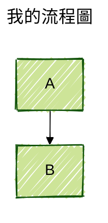

支援主題：

- default
- forest
- dark
- neutral
- base

佈局引擎：

- dagre（預設）
- elk（更強大的自動佈局）

### 指令

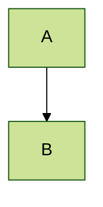

### 註釋與特殊處理

- 單行注釋：`%%`
- 避免保留字：用引號 `"` 包裹
- 常用保留字：`end`, `graph`, `flowchart` 等

### 文字格式

- 粗體：`**文字**`
- 斜體：`*文字*`
- 換行：`<br>` 或 `\n`
- HTML 標簽：支援 `b`, `i`, `u` 等

## 流程圖（Flowchart）

**宣告：**

`flowchart` 或 `graph`（舊版相容）

**方向控制：**

- `TD` / `TB`：由上到下
- `BT`：由下到上
- `LR` / `RL`：由左到右 / 由右到左

### 節點形狀

| 形狀語法 | 顯示效果 | 說明 |
| --- | --- | --- |
| `id[文字]` | 矩形 | 預設 |
| `id(文字)` | 圓角矩形 | - |
| `id((文字))` | 圓形 | - |
| `id{文字}` | 菱形 | 判斷 |
| `id[/文字/]` | 斜邊矩形 | - |
| `id[\\文字\\]` | 斜邊矩形（反向） | - |
| `id>文字]` | 非對稱矩形 | - |

### 連接綫

| 語法 | 箭頭樣式 |
| --- | --- |
| `A --> B` | 實心箭頭 |
| `A --- B` | 無箭頭直線 |
| `A -.-> B` | 虛線箭頭 |
| `A ==> B` | 粗箭頭 |
| `A --o B` | 圓形端點 |

**文字標註：**

- A -->|是| B
- A -- 說明 --- B

### 子圖

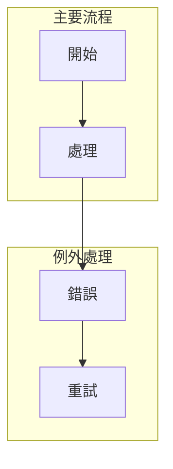

完整範例（商業流程）：

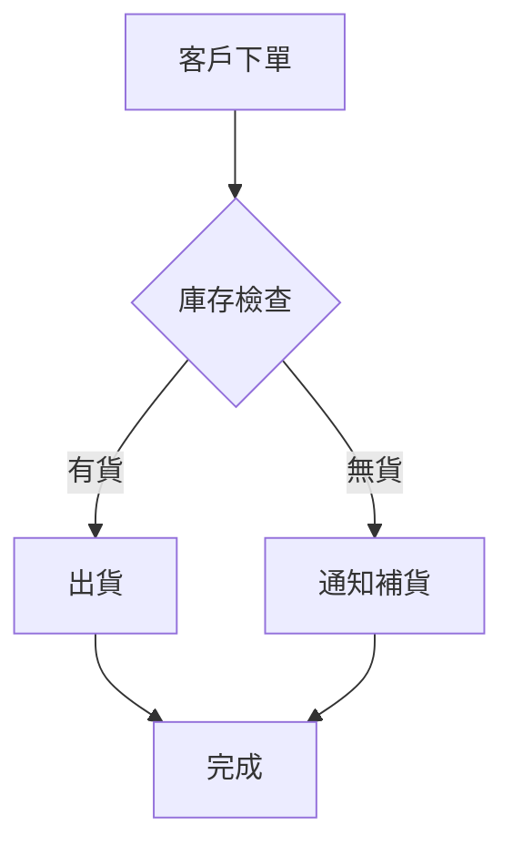

## 序列圖（Sequence Diagram）

**宣告：**

`sequenceDiagram`

**參與者：**

- participant Alice（可使用別名 as A）
- actor User、boundary、control、entity 等角色

### 訊息類型

| 語法 | 意義 |
| --- | --- |
| `A->>B: 注釋` | 實心箭頭（同步） |
| `A-->>B: 注釋` | 虛線箭頭（非同步） |
| `A->>B: 注釋` | 實心箭頭 |
| `B-->>A: 注釋` | 虛線回應 |
| `Note right of A: 注釋` | 右側註記 |

### 進階功能

- activate / deactivate：顯示活躍期
- loop、alt、opt、par：控制結構
- autonumber：自動編號

### 範例（API 呼叫流程）

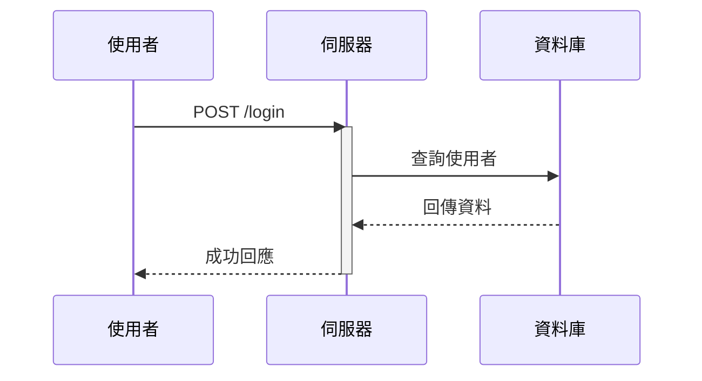

## 類別圖（Class Diagram）

**宣告：**

`classDiagram`

**關係符號：**

### 關係符號

- `|--` 繼承
- `*--` 組合
- `o--` 聚合
- `--` 關聯
- `..>` 依賴
- `..|>` 實現

### 完整範例（OOP 設計）

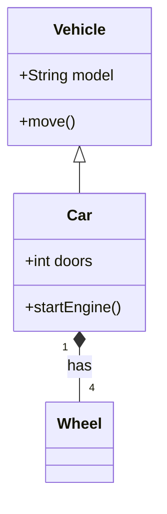

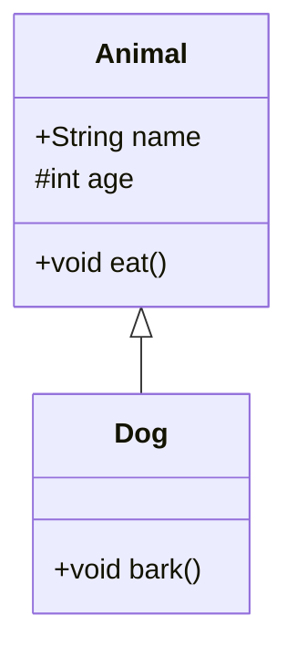

## 狀態圖（State Diagram）

**宣告：**

`stateDiagram-v2`（推薦）或 `stateDiagram`

### 基本語法

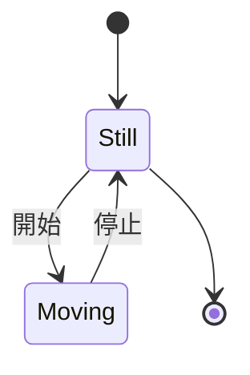

### 複合狀態

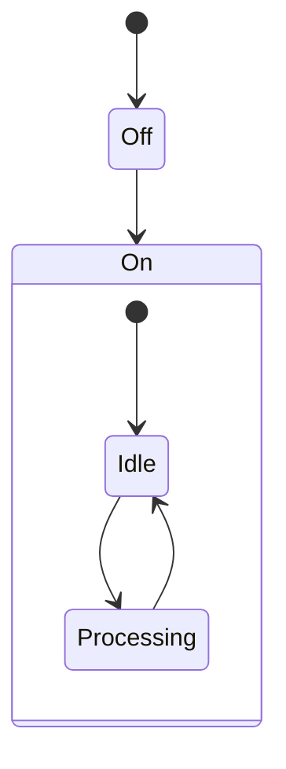

## 實體關係圖（ER Diagram）

**宣告：**

`erDiagram`

### 範例

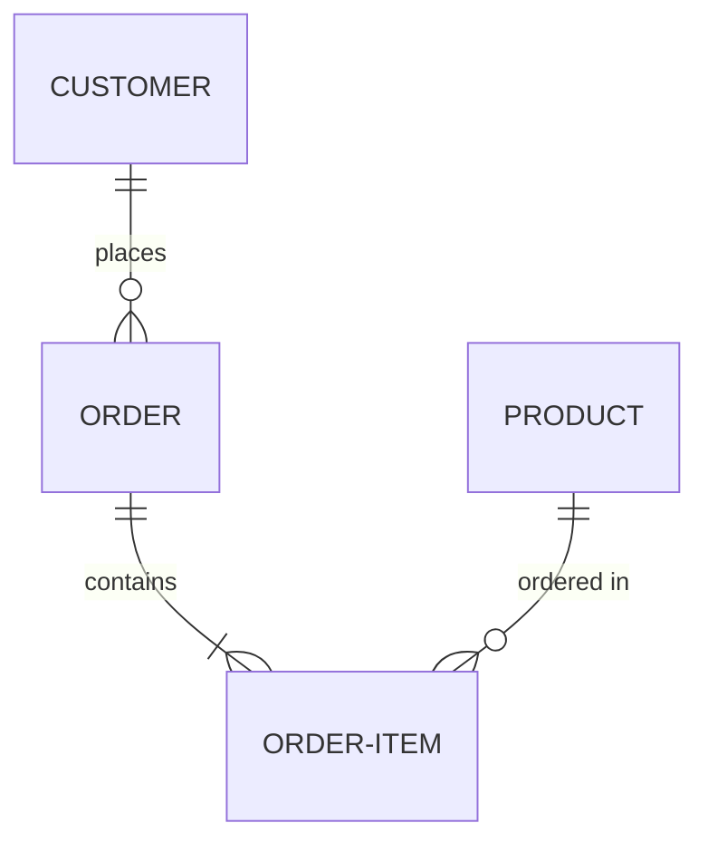

## 甘特圖（Gantt Chart）

**宣告：**`gantt`

**語法重點：**

- section 分區
- 任務 : 開始日期, 持續時間
- 支援 after 任務名

```mermaid
gantt
  title 專案時程
  dateFormat YYYY-MM-DD
  section 規劃
    需求收集 : 2026-04-01, 10d
  section 開發
    前端開發 : 2026-04-15, 20d
    後端開發 : after 前端開發, 15d
```

## 思維導圖（Mindmap）

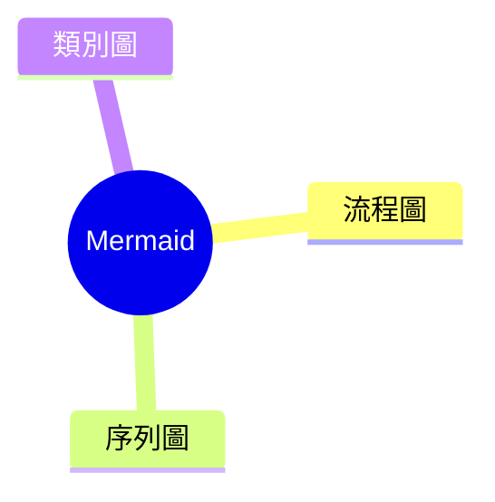

## 時間軸（Timeline）

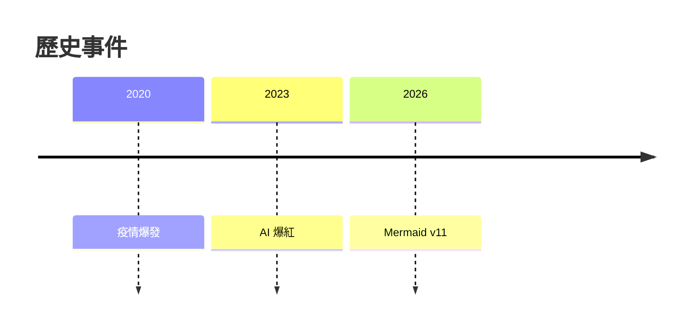

## Git 圖（GitGraph）

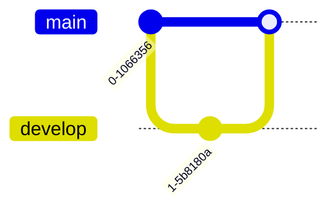
