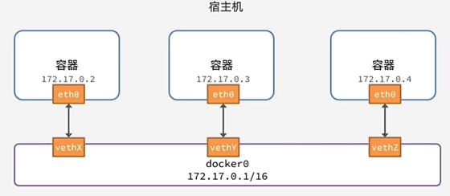

# Docker

## 配置 docker 代理

```sh
su -
mkdir -p /etc/systemd/system/docker.service.d
cd /etc/systemd/system/docker.service.d
touch http-proxy.conf
echo '[Service]
Environment="HTTP_PROXY=http://127.0.0.1:7890"
Environment="HTTPS_PROXY=http://127.0.0.1:7890"
Environment="NO_PROXY=localhost,127.0.0.1"
' > http-proxy.conf
# 重启服务
systemctl daemon-reload
systemctl restart docker
```

## docker 服务

```sh
# 启动|停止|重启|设置自动启动 docker
systemctl start|stop|restart|enable|disable docker
# 查看 docker 版本
docker version
# 查看 docker 信息
docker info
```

## 镜像搜索与拉取

```sh
# 搜索镜像
docker search name
# 过滤stars小于3000的镜像
docker search name --filter=stars=3000
# 拉取镜像
docker pull name:version
```

## 本地镜像管理

```sh
# 查看本地镜像
docker images
docker images -a # 显示所有镜像
docker images -q # 只显示镜像 id

# 删除镜像
docker image rm [name:version|id]
# 强制删除镜像
docker image rm -f [name:version|id]
# 使用 rmi 删除镜像
docker rmi [name:version|id]
```

## 镜像保存与加载及分享

```sh
# 将镜像另存为本地文件
docker save nginx:latest -o nginx.tar
# 使用本地文件加载镜像
docker load -i nginx.tar
# 将一个容器打包为镜像
docker commit -m 'message' CONTAINER [镜像名[:标签]]
# 登陆 docker hub
docker login
# 迎合社区规范，为镜像添加标签
docker tag xxx:v1.0 docker_hub_用户名/xxx:v1.0
# 推送镜像
docker push docker_hub_用户名/xxx:v1.0
```

## 创建或删除容器

```sh
# 创建容器
docker create name
# 删除一个容器
docker rm [name|id]
# 强制删除一个容器
docker rm -f [name|id]
```

## 容器运行

```sh
# 创建并运行容器
docker run -d \               # 让容器在后台运行
--name mysql \                # 为容器起名
-p 10086:3306 \               # 端口映射
-p x:y \                      # 创建多个端口映射
-e TZ=Asia/Shanghai \         # 设置环境变量
-e MYSQL_R00T_PASSWORD=123 \  # 设置多个环境变量
--restart=unless-stopped \    # 设置容器重启策略
mysql:5.7
```

## 容器状态管理

```sh
# 查看活动容器
docker ps
# 查看所有容器
docker ps -a
# 查看容器状态
docker stats [name|id]
# 详细查看一个容器（包括数据卷信息等）
docker inspect nginx
# 启动容器
docker start [name|id]
# 重启容器 
docker restart [name|id]
# 暂停容器
docker stop [name|id]
# 杀死容器
docker kill [name|id]
```

## 容器执行

```sh
# 以交互方式执行容器内的二进制程序
docker exec -it [name|id] bash
# 可以传递参数
docker exec -it [name|id] mysql -uroot -p
```

## docker cp

```sh
docker cp <本地目录> <容器:容器内的目录>
docker cp <容器:容器内的目录> <本地目录>
```

## logs

```sh
# 查看日志
docker logs [name|id]
# 实时显示日志
docker logs -f [nname|id]
```

## 数据卷

```sh
# 创建一个匿名数据卷
docker volume create
# 创建一个数据卷
docker volume create volume_name

# 查看所有数据卷
docker volume ls

# 删除指定数据卷
docker volume rm

# 查看某个数据卷
docker volume inspect

# 清除匿名数据卷
docker volume prune

# 卷映射
# 若数据卷/本地目录不存在将自动创建
docker run -v 数据卷:容器内挂载点
# 目录挂载
docker run -v 本地目录:容器内目录

# 可以挂载多个目录/数据卷
docker run -v ... -v ...
```

## docker 网络

默认情况下，所有容器都是以 bridge 方式连接到 docker 的一个虚拟网桥上



docker0 网络默认不支持主机域名，加入自定义网络的容器可以通过容器名作为域名互相访问，避免了 ip 变化的问题

```sh
# 创建容器的时候为容器指定一个 ip 地址
docker run --name nginx --ip=172.18.0.2 nginx
# 在创建容器的时候就加入 mynet
docker run --network mynet
# 创建一个网络 mynet
docker network create mynet
# 查看某个网络详情
docker network inspect mynet
# 查看所有网络
docker network ls
# 删除一个网络
docker network rm mynet
# 清除未使用网络
docker network prune
# 使容器 nginx 加入 mynet
docker network connect mynet nginx
# 使容器 nginx 离开 mynet
docker network disconnect mynet nginx
```

## Docker Compose

> Docker Compose 通过 docker-compose.yml 来定义一组相关联的应用容器，帮助我们实现多个相互关联的 Docker 容器的快速部署
> 常用作多容器的项目部署以及集群部署

```yml
# 应用名
name: myapp

# 应用版本
version: "0.0.1"

# 应用服务
services:
    mysql:
        container_name: mysql
        iamge: mysql8.0
        ports:
            - "3306:3306"
        environment:
            TZ: Asia/Shanghai
            MYSQL_ROOT_PASSWORD: 123456
        volumes:
            - "mysql-data:/var/lib/mysql"
            - "/app/myconf:/etc/mysql/conf.d"
        networks:
            - mynet
        restart: always

    nginx:
        K: V(类似上面)
        depends_on:
            - mysql(有些容器之间有依赖关系，需要告诉 docker 以先启动依赖容器)

# 数据卷声明
volumes:
    mysql-data:

# 网络声明
networks:
    mynet:
```

```sh
# 指定使用 compose.yaml 在后台上线一个应用
# 如果不指定文件默认使用 compose.yaml
docker compose -f compose.yaml up -d 
# 下线一个应用
docker compose -f compose.yaml down
# 列出所有启动的容器
docker compoer -f compose.yaml ps
# 查看运行的进程
docker compose -f compose.yaml top
# 查看指定容器的日志
docker compose -f compose.yaml logs [name|id]
# 启动容器
docker compose -f compose.yaml start [name|id]
# 停止容器
docker compose -f compose.yaml stop [name|id]
# 重启容器
docker compose -f compose.yaml restart [name|id]
# 容器执行
docker compose -f compose.yaml exec -it [name|id] bash
```

## 镜像自定义

```dockerfile
# 指定基础镜像
FROM openjdk:17

# 自定义标签
LABEL auther=JiapengHu

# 拷贝本地文件到镜像的指定目录
COPY app.jar /app.jar

# 指定暴露端口
EXPOSE 8080

# 容器启动命令
ENTRYPOINT ["java", "-jar", "/app.jar"]
```

```sh
# 在当前目录使用 X 构建一个镜像
# 如何不指定 -f，默认使用 Dockerfile
docker build -f X -t 镜像名:ver .
```
