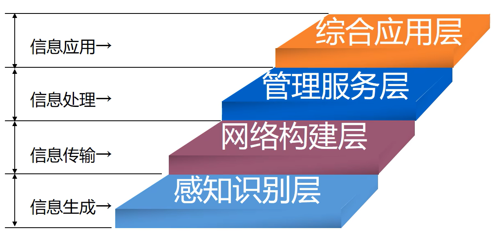

# 物联网导论

## 一、物联网导论

### 1.1 起源与发展

### 1.2 物联网的核心技术

### 1.3 主要特点

- **联网终端规模化**
  - 物联网时代每一件物品均具通信功能成为网络终端，5-10年内联网终端规模有望突破百亿
- **感知识别普适化**
  - 无所不在的感知和识别将传统上分离的物理世界和信息世界高度融合
- **异构设备互联化**
  - 各种异构设备利用无线通信模块和协议自组成网，异构网络通过“网关”互通互联
- **管理处理智能化**
  - 物联网高效可靠组织大规模数据，与此同时，运筹学，机器学习，数据挖掘，专家系统等决策手段将广泛应用于各行各业
- **应用服务链条化**
  - 以工业生产为例，物联网技术覆盖从原材料引进，生产调度节能减排，仓储物流到产品销售，售后服务等各个环节

### 1.4 发展趋势

- 更广泛的互联互通
  - 互联互通的对象从人延伸到物体
  - 互联互通方式的扩展
- 更透彻的感知
  - 通信功能使传感器能够协同工作
- 更深入的智能
  - 多传感器实现“人多力量大”的智能
  - 多维感知数据实现“防患于未然”的智能
  - 大数据挖掘实现“见微知著”的智能

### 1.5 应用前景

- 智能交通
- 智能物流
- 智能建筑
- 环境监测
